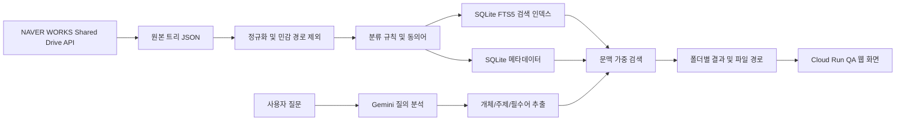

# NAVER WORKS 파일 찾기 POC 진행 현황

작성일: 2026-07-22  
목적: NAVER WORKS 공용 드라이브에 흩어진 업무 파일을 자연어 질문으로 찾고, 최종적으로 NAVER WORKS 봇에서 파일 경로와 링크를 안내하는 기능의 POC를 구축한다.

## 한눈에 보기

- 공용 드라이브의 폴더/파일 메타데이터를 수집해 SQLite 검색 인덱스로 변환했다.
- 로컬과 Cloud Run의 웹 화면에서 자연어로 파일을 검색할 수 있다.
- Gemini는 질문에서 고객사, 제품명, 문서 주제를 추출하는 역할만 하며, 파일명과 경로 자체는 로컬 SQLite에서 검색한다.
- Cloud Run QA 환경은 IAP로 보호되어 있어, 인증된 테스터만 접근할 수 있다.
- 현재는 POC 단계다. 파일 내용(OCR/PDF 본문)은 검색하지 않으며, 최신 승인본 여부나 실제 업무 적합성은 판단하지 않는다.

## 현재 동작 흐름

## 완료된 범위

### 1. NAVER WORKS 인증 및 데이터 수집

- OAuth 인가 코드 방식으로 NAVER WORKS Drive API 접근 흐름을 구성했다.
- 짧은 수명의 Access Token을 파일에 저장하지 않고, Refresh Token 기반으로 메모리에서 갱신하도록 구현했다.
- NAVER WORKS Client Secret과 Refresh Token은 Google Secret Manager에서 관리할 수 있다.
- 수집 중 API `429 Too Many Requests`가 발생할 경우 재시도와 지수 백오프를 적용했다.
- 원본 파일은 내려받지 않고, 파일 ID, 상위 ID, 이름, 경로, 유형, 수정 시각 등 메타데이터만 수집한다.

### 2. 검색 인덱스

- 수집한 두 개 소스를 하나의 SQLite DB로 통합했다.
- 현재 인덱스 문서 수: **7,811건**
- 현재 인덱스 소스 수: **2개**
- SQLite FTS5로 한글 부분 검색, 파일 유형, 확장자, 태그 검색을 지원한다.
- 업무 규칙 기반 텍소노미와 동의어 사전을 적용했다.
- `아이디비번`, `계정정보`, `password`, `credentials`, `secret` 등의 민감 경로와 하위 항목은 인덱싱 대상에서 제외한다.
- 현재 수집본에서는 민감 경로 제외 건수가 0건이다. 이는 수집 대상에 해당 경로가 없었거나 수집 이전 단계에서 이미 제외되었음을 의미하므로, 운영 전 실제 제외 목록을 재확인해야 한다.

### 3. 자연어 검색 품질 개선

- 질문에서 조사와 표현을 정리하고, 고객사·제품명·문서 주제 같은 핵심어를 추출한다.
- 예: `롯데홈쇼핑에 제출한 팥죽 원산지 문서는 어디에?`
- 추출 결과를 기준으로 검색어 충족률, 경로 내 고객사 일치, 파일명/경로의 주제 일치에 가중치를 부여한다.
- 결과는 고객사 또는 핵심 개체가 포함된 폴더 기준으로 묶어 보여 준다.
- Gemini 연결이 불가할 때도 기본 검색이 중단되지 않도록 규칙 기반 `fallback` 분석기를 제공한다.
- Gemini 모델은 현재 사용 가능한 `gemini-3.1-flash-lite`로 설정했으며, Gemini에는 사용자 질문만 전달한다. 파일 경로와 파일명은 외부 모델에 보내지 않는다.

### 4. QA 웹 화면 및 배포

- FastAPI 기반 검색 API와 간단한 웹 UI를 만들었다.
- 주요 엔드포인트:
  - `GET /`: 검색 UI
  - `GET /api/search?query=...`: 문맥 검색 결과
  - `GET /healthz`: 인덱스 및 분석기 상태 확인
- Cloud Run QA 서비스: `damccot-naverworks-search`
- QA 주소: <https://damccot-naverworks-search-877007649543.asia-northeast3.run.app>
- 서비스는 IAP로 보호된다. 공개 접근은 허용하지 않았다.
- 배포 이미지에는 검색용 SQLite DB만 포함하며, 원본 Shared Drive JSON은 포함하지 않는다.
- Gemini API 키는 Secret Manager에서 Cloud Run 런타임 환경 변수로 주입한다.

## 검증 결과

- 자동 테스트: **34개 전체 통과**
- SQLite 인덱스 무결성 검증 완료
- Gemini API 키를 Secret Manager 경유로 읽는 구성 확인
- Gemini 질의 분석 직접 호출 성공
- Cloud Run 신규 리비전에 Gemini 모델 설정 반영 완료
- IAP 인증을 통과한 사용자만 QA URL을 열 수 있는 구성을 유지

## 현재 확인할 사항과 제약

| 항목 | 현재 상태 | 팀 QA에서 확인할 내용 |
| --- | --- | --- |
| 데이터 범위 | 2개 수집 소스, 7,811건 | 필요한 공용 드라이브와 권한 제한 폴더가 모두 포함되었는지 |
| 검색 대상 | 파일명, 폴더명, 경로, 유형, 태그 | 파일 본문을 검색해야 하는 업무가 많은지 |
| 정확도 | 고객사/제품/주제 중심 경로 가중 | 실제 표현으로 질문했을 때 상위 3건 안에 원하는 파일이 나오는지 |
| 최신성 | 수집 시점의 스냅샷 | 정기 수집과 인덱스 재생성 주기를 어떻게 둘지 |
| 파일 링크 | 경로만 표시 | NAVER WORKS에서 바로 열기 링크가 필요한지 |
| 권한 | IAP는 웹 UI 보호, NAVER WORKS 권한은 별도 | 테스터별 NAVER WORKS 파일 접근 권한이 충분한지 |

## NAVER WORKS 파일 링크 기능

검색 인덱스에는 각 항목의 `sharedriveId`와 `fileId`가 보존되어 있다. 따라서 결과별로 NAVER WORKS Drive API의 파일 링크 조회를 호출하면 `https://works.do/...` 형식의 링크를 받아 UI 또는 향후 챗봇에 표시할 수 있다.

보안상 권장 방식은 다음과 같다.

1. 검색 결과를 클릭할 때만 기존 공유 링크를 조회한다.
2. 이미 존재하는 링크만 반환한다.
3. 링크가 없으면 경로만 표시한다.
4. 자동으로 공유 링크를 생성하지 않는다.

링크 생성은 파일의 공유 범위와 권한에 영향을 줄 수 있으므로, 별도 보안 정책이 정해지기 전에는 자동 생성 기능을 넣지 않는다.

## 다음 작업 권장 순서

### 1차: QA와 검색 품질 기준 확정

1. 팀원별 실제 업무 질문 20~30개를 수집한다.
2. 각 질문의 기대 파일 또는 기대 폴더를 정한다.
3. 상위 3건 기준으로 성공/부분 성공/실패를 기록한다.
4. 오탐 사례를 고객사명, 제품명, 문서 유형, 오래된 파일, 중복 폴더로 분류한다.
5. 텍소노미 규칙과 동의어 사전을 보정한다.

완료 기준: 대표 질문에서 원하는 폴더 또는 파일이 상위 3건에 안정적으로 노출되고, 민감 경로가 노출되지 않는다.

### 2차: NAVER WORKS 열기 링크 연결

1. 검색 결과 API에 내부 식별자를 안전하게 연결한다.
2. Cloud Run이 NAVER WORKS Refresh Token으로 Access Token을 갱신하도록 구성한다.
3. 클릭 시에만 기존 파일 링크를 조회하는 API를 추가한다.
4. UI에 `NAVER WORKS에서 열기` 버튼과 링크 없음 상태를 표시한다.
5. 조직 내 사용자와 권한 없는 사용자의 동작을 각각 확인한다.

완료 기준: 권한이 있는 사용자가 검색 결과에서 해당 파일을 바로 열 수 있고, 권한이나 링크가 없는 경우에도 파일 경로는 안전하게 안내된다.

### 3차: 운영 가능한 갱신 흐름

1. 공용 드라이브별 수집 범위와 접근 권한을 확정한다.
2. 수집 -> 민감 경로 검사 -> SQLite 재생성 -> 검증 -> Cloud Run 배포 순서를 자동화한다.
3. 정기 실행 주기와 실패 알림 방식을 정한다.
4. 수집 전후 파일 수, 제외 수, 오류 수를 기록한다.

완료 기준: 담당자가 수동으로 Access Token을 교체하지 않아도 정해진 주기로 인덱스를 갱신할 수 있다.

### 4차: NAVER WORKS 챗봇 연동

1. 현재 `/api/search`를 챗봇 응답 형식으로 감싼다.
2. 상위 결과의 파일명, 경로, 이유, 열기 링크를 카드 형태로 보낸다.
3. IAP 대신 NAVER WORKS Bot Callback 검증과 사용자 식별 정책을 적용한다.
4. 챗봇 대화 로그에는 파일 경로나 민감 검색어를 과도하게 보관하지 않도록 정책을 정한다.

## 팀원 QA 요청 사항

- QA URL에서 본인의 업무 표현으로 질문해 주세요.
- 원하는 파일이 있으면 파일명 또는 경로를 함께 기록해 주세요.
- 결과가 넓게 나오면 질문 문장과 상위 결과 3개를 남겨 주세요.
- 결과가 없으면 해당 파일이 어느 공용 드라이브에 있는지와 대략의 경로를 남겨 주세요.
- 링크 기능이 필요한 업무는 “파일 바로 열기”가 필요한지, “폴더까지 이동”이면 충분한지도 알려 주세요.

## 참고 경로

- 검색 인덱스 구축 지침: `directives/build_search_index.md`
- 로컬 검색 UI 실행 지침: `directives/run_search_ui.md`
- Cloud Run 배포 지침: `directives/deploy_search_cloud_run.md`
- 프로젝트 개요와 실행 방법: `README.md`

## 결론

현재 POC는 “폴더와 파일명 기반으로 사내 자료의 위치를 찾는 검색 엔진”까지 구현되어 있으며, QA를 시작할 수 있는 상태다. 다음 우선순위는 검색 품질을 실제 업무 질문으로 검증하고, 그 결과를 바탕으로 규칙을 보정한 뒤 NAVER WORKS 파일 열기 링크를 안전하게 연결하는 것이다.
